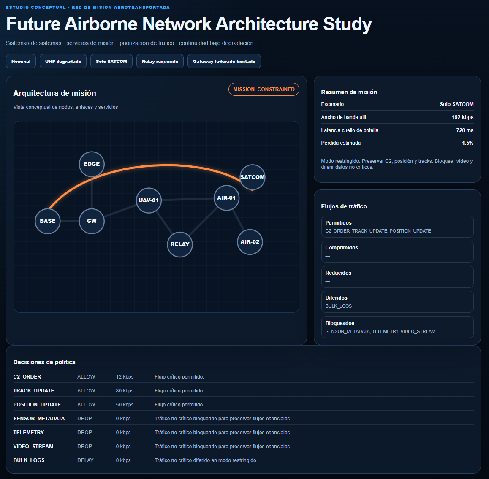

# Future Airborne Network Architecture Study

Estudio conceptual y simulador ligero sobre arquitecturas futuras de red de misión aerotransportada.

<p align="center">
  
</p>

Este repositorio está escrito en castellano y combina:

- estudio técnico de arquitectura;
- modelo de nodos, enlaces, servicios y tráfico;
- simulador ligero de continuidad de misión;
- dashboard web con FastAPI;
- reportes JSON;
- documentación para publicación técnica.

> **Nota de alcance:** este proyecto es un laboratorio conceptual, educativo y de portfolio. No representa ningún programa real, no implementa capacidades operacionales, no describe enlaces clasificados y no debe interpretarse como arquitectura oficial de ningún sistema concreto.

---

## 1. Idea principal

Las redes aéreas futuras no pueden entenderse solo como enlaces de comunicaciones aislados. Deben verse como **sistemas de información de misión**, donde plataformas tripuladas, no tripuladas, nodos relay, enlaces SATCOM, servicios edge y pasarelas federadas cooperan para mantener los flujos críticos de información.

El objetivo del proyecto es estudiar esta idea:

> En una arquitectura aérea futura, la pregunta no es solo si hay conectividad, sino qué información de misión puede seguir fluyendo cuando la red se degrada.

---

## 2. Escenario genérico

```text
                 SATCOM
                   |
                   |
        +----------+----------+
        |                     |
      BASE              Mission Cloud / Edge
        |
        |
   Ground Gateway
        |
        |
      UAV-01 ------------- AIR-01
        \\                   /
         \\                 /
          \\               /
           RELAY-01 ---- AIR-02
```

Nodos principales:

- `BASE`: puesto de mando o nodo de control terrestre.
- `GROUND-GW`: pasarela terrestre hacia red de misión.
- `UAV-01`: nodo no tripulado de apoyo y relay.
- `RELAY-01`: nodo de retransmisión.
- `AIR-01`: plataforma aérea principal.
- `AIR-02`: plataforma aérea secundaria.
- `MISSION-EDGE`: nodo de servicios edge / nube de misión.
- `SATCOM-GW`: pasarela de respaldo por SATCOM.

---

## 3. Qué estudia el repositorio

El estudio analiza:

- arquitectura de red por capas;
- nodos y enlaces de misión;
- clases de tráfico;
- priorización bajo degradación;
- continuidad de misión;
- uso de relay;
- modo SATCOM-only;
- servicios edge;
- interoperabilidad y federación;
- visualización operativa.

---

## 4. Estados de misión

El simulador clasifica el estado de la misión como:

| Estado | Significado |
|---|---|
| `MISSION_READY` | La arquitectura soporta todos los flujos principales |
| `MISSION_DEGRADED` | La misión continúa, pero con compresión/reducción de flujos |
| `MISSION_CONSTRAINED` | Solo sobreviven flujos esenciales |
| `MISSION_CRITICAL` | El ancho de banda no permite sostener el mínimo crítico |

---

## 5. Clases de tráfico

| Prioridad | Tipo | Tratamiento |
|---:|---|---|
| P1 | `C2_ORDER` | Siempre debe transmitirse |
| P2 | `TRACK_UPDATE` | Crítico para situación táctica |
| P2 | `POSITION_UPDATE` | Crítico para seguimiento propio |
| P3 | `SENSOR_METADATA` | Comprimible en degradación |
| P4 | `TELEMETRY` | Reducible en frecuencia |
| P6 | `VIDEO_STREAM` | Se corta en modo restringido |
| P7 | `BULK_LOGS` | Se retrasa para sincronización posterior |

---

## 6. Escenarios incluidos

El simulador incluye cinco escenarios:

| Escenario | Descripción | Estado esperado |
|---|---|---|
| `nominal` | Todos los enlaces principales disponibles | `MISSION_READY` |
| `uhf_degraded` | Enlace UHF degradado, se comprimen/reducen flujos | `MISSION_DEGRADED` |
| `satcom_only` | Solo queda SATCOM, sobreviven flujos críticos | `MISSION_CONSTRAINED` |
| `relay_required` | El enlace directo no es viable, se usa relay | `MISSION_DEGRADED` |
| `coalition_gateway_limited` | Pasarela federada limitada, se restringen flujos | `MISSION_CONSTRAINED` |

---

## 7. Dashboard preview

| Escenario | Captura | Lectura técnica |
|---|---|---|
| `nominal` | [`dashboard-nominal.png`](assets/dashboard-nominal.png) | La arquitectura soporta los flujos principales |
| `uhf_degraded` | [`dashboard-uhf-degraded.png`](assets/dashboard-uhf-degraded.png) | La misión continúa con degradación controlada |
| `satcom_only` | [`dashboard-satcom-only.png`](assets/dashboard-satcom-only.png) | Solo sobreviven flujos esenciales por SATCOM |
| `relay_required` | [`dashboard-relay-required.png`](assets/dashboard-relay-required.png) | El relay recupera continuidad cuando el enlace directo no es viable |
| `coalition_gateway_limited` | [`dashboard-coalition-gateway-limited.png`](assets/dashboard-coalition-gateway-limited.png) | La pasarela federada restringe qué datos se intercambian |

---

## 8. Arquitectura del proyecto

```text
Datos JSON
   ↓
Simulador Python
   ↓
Evaluador de misión
   ↓
Política de tráfico
   ↓
Reportes JSON
   ↓
FastAPI + Dashboard
```

---

## 9. Instalación

```bash
python -m venv .venv
```

Windows PowerShell:

```powershell
.venv\Scripts\Activate.ps1
```

Linux/macOS:

```bash
source .venv/bin/activate
```

Instalación recomendada:

```bash
pip install -e ".[dev]"
```

---

## 10. Ejecutar tests

```bash
pytest -q
```

Validado localmente:

```text
6 passed, 1 warning
```

Ver validación: [`docs/local-mvp-validation.md`](docs/local-mvp-validation.md)

---

## 11. Generar reportes

```bash
python scripts/generate_reports.py
```

Los reportes se guardan en:

```text
reports/
```

Reportes generados:

```text
nominal-report.json
uhf_degraded-report.json
satcom_only-report.json
relay_required-report.json
coalition_gateway_limited-report.json
```

---

## 12. Ejecutar dashboard

```bash
uvicorn app.main:app --reload
```

Abrir:

```text
http://127.0.0.1:8000/?v=2
```

---

## 13. Endpoints API

```text
GET  /api/scenarios
GET  /api/evaluate/{scenario}
GET  /api/reports
POST /api/playback
```

Ejemplo:

```bash
curl http://127.0.0.1:8000/api/evaluate/satcom_only
```

---

## 14. Estructura del repositorio

```text
future-airborne-network-architecture-study/
├── README.md
├── pyproject.toml
├── requirements.txt
├── docs/
├── src/future_airborne_network_study/
├── app/
├── data/
├── reports/
├── tests/
├── assets/
└── linkedin/
```

---

## 15. Valor profesional

Este proyecto demuestra:

- criterio de arquitectura de comunicaciones;
- visión de sistemas de sistemas;
- entendimiento de tráfico de misión;
- priorización bajo restricciones;
- resiliencia ante degradación;
- modelado de nodos/enlaces/servicios;
- capacidad de construir un estudio técnico, no solo código;
- visualización de continuidad de misión;
- enfoque seguro y público sobre conceptos de redes aéreas futuras.

La idea clave:

> Una red de misión futura no debe diseñarse solo para transportar paquetes, sino para preservar los flujos de información que sostienen la decisión.
